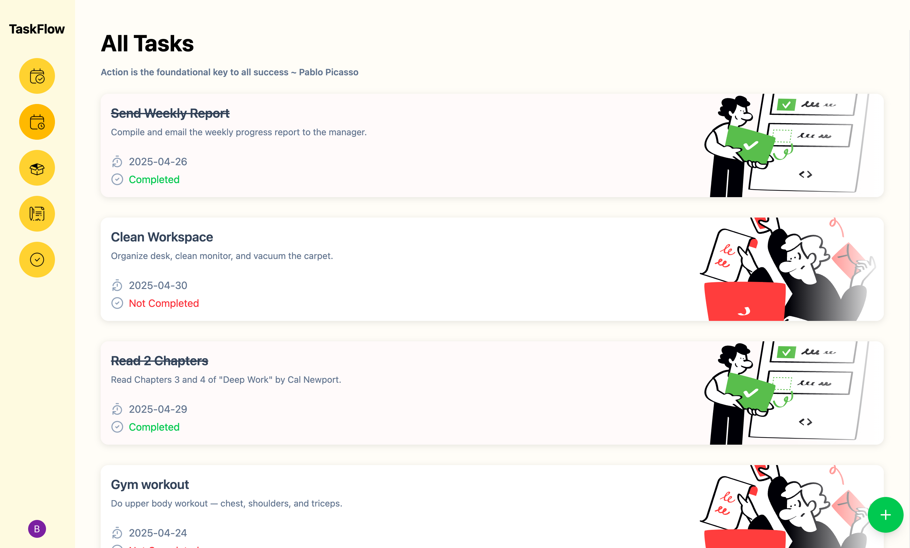
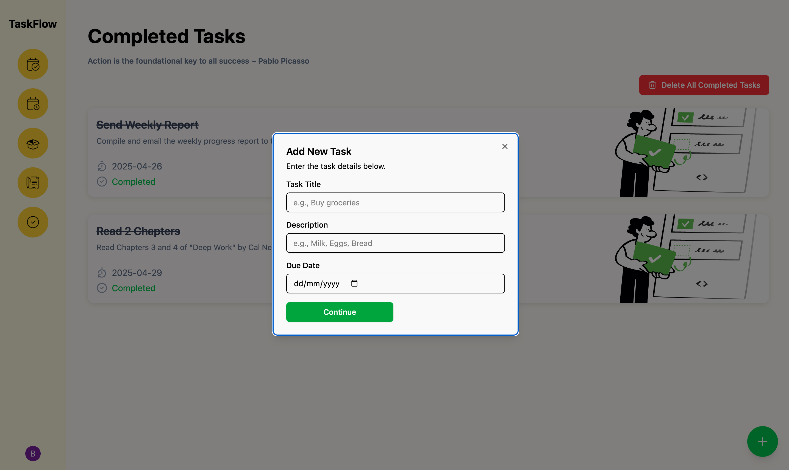

# MyPatta Todo Application

A modern, scalable, and maintainable Todo application built with React, TypeScript, and Vite. This application demonstrates best practices in component-driven development, state management, and user authentication.

## 📱 Application Preview

### All Tasks View

The main dashboard displays all tasks with their status, due dates, and descriptions. Each task card includes:
- Task title with strike-through for completed tasks
- Task description
- Due date
- Completion status indicator
- Beautiful illustrations for better visual feedback

### Task Management

The "Add New Task" modal provides a clean, user-friendly interface for creating new tasks with:
- Task title input
- Detailed description field
- Due date picker
- Intuitive "Continue" button
- Clear form layout for better user experience

## 🚀 Getting Started

### Prerequisites
- Node.js (v18 or higher)
- npm or yarn package manager

### Installation

1. Clone the repository:
```bash
git clone https://github.com/yourusername/mypatta-todo.git
cd mypatta-todo
```

2. Install dependencies:
```bash
npm install
# or
yarn install
```

3. Create a `.env` file in the root directory and add your environment variables:
```env
VITE_CLERK_PUBLISHABLE_KEY=your_clerk_publishable_key
```

4. Start the development server:
```bash
npm run dev
# or
yarn dev
```

The application will be available at `http://localhost:5173`

## 🎯 Features

- **Task Management**
  - Create, read, update, and delete todos
  - Mark todos as complete/incomplete (with visual strike-through effect)
  - Due date tracking with clear visual indicators
  - Task categorization and organization

- **User Interface**
  - Clean and modern design
  - Responsive layout that works on all devices
  - Intuitive task creation modal
  - Visual feedback for task status
  - Custom illustrations for better user experience

- **Additional Features**
  - User authentication using Clerk
  - Filter todos by status
  - Responsive design with Tailwind CSS
  - Dark/Light mode support
  - Modern UI components using Radix UI

## 🏗️ Project Structure

```
src/
├── components/     # Reusable UI components
├── controllers/    # Business logic and data management
├── hooks/         # Custom React hooks
├── lib/           # Utility functions and configurations
├── pages/         # Page components
└── assets/        # Static assets
```

## 🛠️ Technologies Used

### Core Technologies
- **React**: A JavaScript library for building user interfaces
- **TypeScript**: For type safety and better developer experience
- **Vite**: Next-generation frontend tooling
- **Tailwind CSS**: Utility-first CSS framework
- **Radix UI**: Unstyled, accessible components

### Authentication
- **Clerk**: For user authentication and management

### Development Tools
- **ESLint**: For code linting
- **TypeScript**: For static type checking
- **Vite**: For fast development and building

## 📈 Scalability and Architecture

### Component-Driven Development
- Modular components that can be reused across the application
- Clear separation of concerns between UI and business logic
- Consistent component structure for better maintainability

### State Management
- Efficient state management using React hooks
- Separation of concerns between UI and data management
- Scalable data flow patterns

### Maintainable Architecture
- Clear folder structure for better organization
- Separation of concerns between different layers
- Reusable components and hooks
- Type safety with TypeScript
- Consistent coding standards with ESLint

## 🔧 Development

### Available Scripts

- `npm run dev` - Start development server
- `npm run build` - Build for production
- `npm run lint` - Run ESLint
- `npm run preview` - Preview production build

### Code Style
- Follows ESLint configuration
- Uses TypeScript for type safety
- Follows React best practices

## 🤝 Contributing

1. Fork the repository
2. Create your feature branch (`git checkout -b feature/AmazingFeature`)
3. Commit your changes (`git commit -m 'Add some AmazingFeature'`)
4. Push to the branch (`git push origin feature/AmazingFeature`)
5. Open a Pull Request

## 📝 License

This project is licensed under the MIT License - see the LICENSE file for details.
